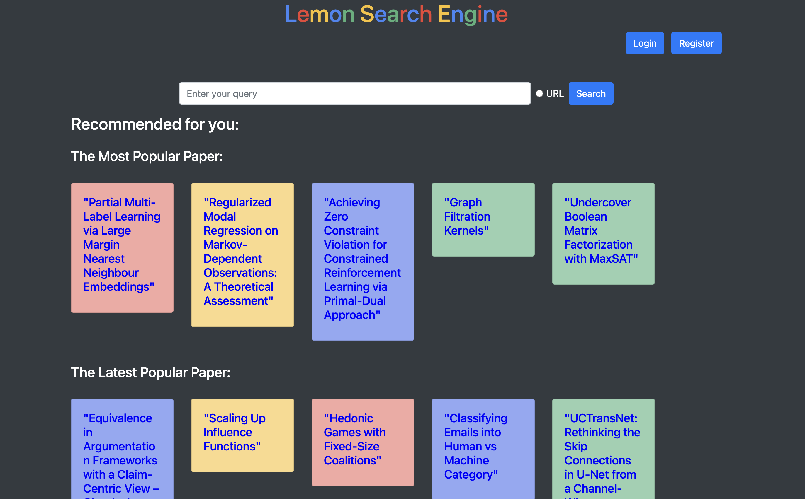

---

### <<<<<<<<<<<<<<<<<<<< Start of Template >>>>>>>>>>>>>>>>>>>>

---

## SECTION 1 : PROJECT TITLE
## Lemon Academic Search Recommender System

---

## SECTION 2 : EXECUTIVE SUMMARY / PAPER ABSTRACT
Embarking on a PhD is a rigorous academic endeavor. Students are required to deeply engage in specialized fields, collaborating and exchanging insights with global researchers. To excel academically, they continuously delve into, peruse, and dissect numerous scholarly articles. Along this journey, challenges arise, including determining which papers to study, pinpointing their research trajectory, and keeping abreast of groundbreaking studies. While Google Scholar stands as a predominant academic search tool, offering vast scholarly resources, it is not without its limitations.

Recognizing these challenges, I embarked on crafting an innovative academic search engine, harnessing the power of Java and SpringBoot. This engine aspires to bridge the gaps inherent in Google Scholar, delivering more precise and tailored search experiences. Tailored for aspirant PhD candidates unfamiliar with the vast academic landscape or their specific research interests, my platform equips them with features like curated article suggestions, search term enhancements, visual word cloud representations, concise article summaries, and more. To enrich the user experience, functionalities such as liking, saving, and browsing history have been integrated, ensuring users have a comprehensive overview of their academic journey while enabling the system to refine its user-centric recommendations. Beyond facilitating a seamless search experience for students, this initiative opens new horizons and prospects for the broader scholarly domain.

Utilizing the methodologies and principles acquired during my coursework, I systematically approached the development of this search engine. The foundational knowledge imparted in class became instrumental, offering both a roadmap for the software architecture and insights into user experience design. I diligently applied concepts like data structuring, algorithm optimization, and user-centric design, ensuring that the engine was both efficient and user-friendly.

Furthermore, this project transcended beyond just technical development; it was a deep dive into understanding the intricacies of user behavior and academic research. It pushed me to amalgamate technical skills with a deep sense of empathy for my target audience. Reflecting on this journey, I've come to appreciate the pivotal role that structured learning plays in real-world applications. The marriage of theory and practicality not only results in efficient systems but also ones that truly resonate with users' needs. This venture has solidified my belief in the importance of continuous learning and its tangible impact, propelling me to further harness my academic insights for real-world challenges.

---

## SECTION 3 : CREDITS / PROJECT CONTRIBUTION

| Official Full Name  | Student ID (MTech Applicable)  | Work Items  | Email (Optional) |
| :------------ |:---------------:| :-----| :-----|
| Bian Weizhen  | A0285814W | ALL| E1221626@nus.edu.sg |

---

## SECTION 4 : BUSINESS VIDEO 

---

---

## SECTION 5 : TECHNICAL VIDEO

---

## SECTION 6 : USER GUIDE

`Refer to appendix <Installation & User Guide> in project report at Github Folder: ProjectReport`

### [ 1 ] To run the system using iss-vm

> download pre-built virtual machine from http://bit.ly/iss-vm

> start iss-vm

> open terminal in iss-vm

> $ git clone https://github.com/telescopeuser/Workshop-Project-Submission-Template.git

> $ source activate iss-env-py2

> (iss-env-py2) $ cd Workshop-Project-Submission-Template/SystemCode/clips

> (iss-env-py2) $ python app.py

> **Go to URL using web browser** http://0.0.0.0:5000 or http://127.0.0.1:5000

### [ 2 ] To run the system in other/local machine:
### Install additional necessary libraries. This application works in python 2 only.

> $ sudo apt-get install python-clips clips build-essential libssl-dev libffi-dev python-dev python-pip

> $ pip install pyclips flask flask-socketio eventlet simplejson pandas

---
## SECTION 7 : PROJECT REPORT

`Refer to project report at Github Folder: ProjectReport`

**Recommended Sections for Project Report / Paper:**
***Introduction***
- Executive Summary
- Business Problem Background
- Market Research
- Proposed System
- Functional and Non-functional Requirements
- Implementation
***Project Solution***
- Domain Modeling
- System Design
***Project Implementation***
- System Development
- Testing Approach
***Project Performance & Validation***
***Project Conclusions***
***Appendix***
- Project Proposal
- Mapped System Functionalities (MR, RS, CGS)
- Installation and User Guide
- Individual project report

---

### <<<<<<<<<<<<<<<<<<<< End of Template >>>>>>>>>>>>>>>>>>>>

---

**This [Machine Reasoning (MR)](https://www.iss.nus.edu.sg/executive-education/course/detail/machine-reasoning "Machine Reasoning") course is part of the Analytics and Intelligent Systems and Graduate Certificate in [Intelligent Reasoning Systems (IRS)](https://www.iss.nus.edu.sg/stackable-certificate-programmes/intelligent-systems "Intelligent Reasoning Systems") series offered by [NUS-ISS](https://www.iss.nus.edu.sg "Institute of Systems Science, National University of Singapore").**

**Lecturer: [GU Zhan (Sam)](https://www.iss.nus.edu.sg/about-us/staff/detail/201/GU%20Zhan "GU Zhan (Sam)")**

**zhan.gu@nus.edu.sg**
