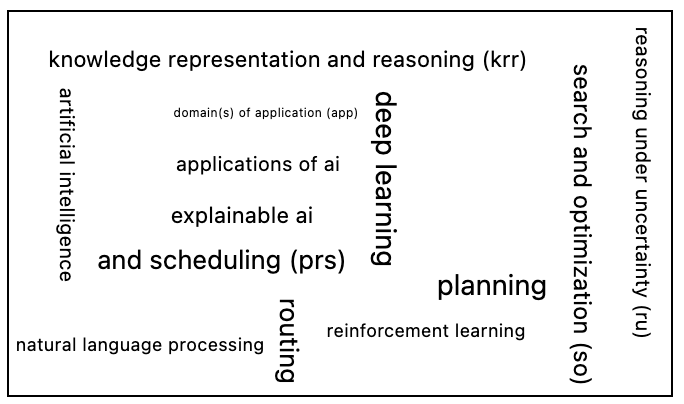

---

### <<<<<<<<<<<<<<<<<<<< Start of Template >>>>>>>>>>>>>>>>>>>>

---

## SECTION 1 : PROJECT TITLE
## Lemon Academic Search Recommender System


---

## SECTION 2 : EXECUTIVE SUMMARY / PAPER ABSTRACT
Embarking on a PhD is a rigorous academic endeavor. Students are required to deeply engage in specialized fields, collaborating and exchanging insights with global researchers. To excel academically, they continuously delve into, peruse, and dissect numerous scholarly articles. Along this journey, challenges arise, including determining which papers to study, pinpointing their research trajectory, and keeping abreast of groundbreaking studies. While Google Scholar stands as a predominant academic search tool, offering vast scholarly resources, it is not without its limitations.

Recognizing these challenges, I embarked on crafting an innovative academic search engine, harnessing the power of Java and SpringBoot. This engine aspires to bridge the gaps inherent in Google Scholar, delivering more precise and tailored search experiences. Tailored for aspirant PhD candidates unfamiliar with the vast academic landscape or their specific research interests, my platform equips them with features like curated article suggestions, search term enhancements, visual word cloud representations, concise article summaries, and more. To enrich the user experience, functionalities such as liking, saving, and browsing history have been integrated, ensuring users have a comprehensive overview of their academic journey while enabling the system to refine its user-centric recommendations. Beyond facilitating a seamless search experience for students, this initiative opens new horizons and prospects for the broader scholarly domain.

Utilizing the methodologies and principles acquired during my coursework, I systematically approached the development of this search engine. The foundational knowledge imparted in class became instrumental, offering both a roadmap for the software architecture and insights into user experience design. I diligently applied concepts like data structuring, algorithm optimization, and user-centric design, ensuring that the engine was both efficient and user-friendly.

Furthermore, this project transcended beyond just technical development; it was a deep dive into understanding the intricacies of user behavior and academic research. It pushed me to amalgamate technical skills with a deep sense of empathy for my target audience. Reflecting on this journey, I've come to appreciate the pivotal role that structured learning plays in real-world applications. The marriage of theory and practicality not only results in efficient systems but also ones that truly resonate with users' needs. This venture has solidified my belief in the importance of continuous learning and its tangible impact, propelling me to further harness my academic insights for real-world challenges.

---

## SECTION 3 : CREDITS / PROJECT CONTRIBUTION

| Official Full Name  | Student ID (MTech Applicable)  | Work Items  | Email (Optional) |
| :------------ |:---------------:| :-----| :-----|
| Bian Weizhen  | A0285814W | ALL| E1221626@nus.edu.sg |

---

## SECTION 4 : BUSINESS VIDEO 

[](https://youtu.be/-AiYLUjP6o8 "Sudoku AI Solver")

---

---

## SECTION 5 : TECHNICAL VIDEO

[](https://youtu.be/-AiYLUjP6o8 "Sudoku AI Solver")

---

## SECTION 6 : USER GUIDE

### [ 1 ] Setup Instructions

Before you begin, ensure you meet the following requirements:

> Prerequisites:

1. Operating System: macOS (recommended).
2. IDE: IntelliJ IDEA (recommended as it auto-identifies and installs project dependencies).
3. Java: JDK 11.

> Steps:
1. Install IntelliJ IDEA: Download and install from the [official website](https://www.jetbrains.com/idea/download/#section=mac).
2. Install Java JDK 11: Download JDK 11 from the [Oracle official](https://www.oracle.com/java/technologies/javase-jdk11-downloads.html) site and follow the on-screen installation instructions.
3. Clone the Repository:
   
```
git clone https://github.com/LuckyBian/ISY5001.git
```

5. Open the cloned repository in IntelliJ IDEA.
6. Wait for the IDE to automatically detect and install all Maven dependencies.

After completing the above steps, your application should be up and running. If you encounter any problems, please double-check that all prerequisites are met.

### [ 2 ] Data Collection

For the functionality of the academic search engine, there are two primary ways to acquire the data:
1. Using Pre-collected Data
2. Web Scraping for New Data

>Using Pre-collected Data

For those who wish to use the pre-collected dataset, here's what's included:

1. collectedData.csv:
Contains information of 1,000 academic articles, encompassing title, link, year, abstract, keywords, and more.

2. data_table.ser:
Stores the mapping between core terms and associated article information.

3. User Interactions:
userActivity.xlsx: Records user click activities.
likeActivity.xlsx: Logs liked articles by the users.
starActivity.xlsx: Registers user's favorite or starred articles.

These datasets are perfect for a test run and to check the effectiveness of the academic search engine.

>Web Scraping for New Data

If you want to collect more data or collect a new dataset, you can find DataScraper.java and adjust the parameters. For data crawling algorithms and detailed explanation of parameters, please refer to REPORT.(Note: The NUS campus network is unable to access some of the web pages and the data collection fails. Please connect to other networks such as cell phone hotspot for collection)

1. Parameter adjustment：

| Parameter        | Type      | Description                                                                                             |
|------------------|-----------|---------------------------------------------------------------------------------------------------------|
| V                | int       | Total number of articles to collect.                                                                    |
| U                | int       | Size of the pool for potential articles.                                                                |
| DATA_FILE_NAME   | string    | Location to save the mapping between search terms and article details.                                  |
| N_THREADS        | int       | Number of threads for parallel data scraping.                                                           |
| CSV_FILENAME     | string    | File location to save the articles.                                                                     |
| webFilter        | boolean   | Toggle to filter out non-academic or irrelevant websites.                                               |
| Ssem             | Boolean   | Option to lemmatize or bring search terms to their base form.                                           |
| webid            | int       | Initial value for web identification.                                                                   |
| seedUrl          | string    | Initial URL(s) to start the scraping. You can have multiple seedUrls to gather a diverse range of articles. Add them to the initial pool for wider coverage. |

In addition, you can modify the regular expression in the code to get more papers or the FEATURES of the papers.

2. Find DataScraper.java in IntelliJ IDEA and click run.

Please note that since my code uses multiple threads, make sure there are no issues with network quality, otherwise data collection will fail.

### [ 3 ] Running Application

If data collection is complete, make sure data_table.ser and collectedData.csv exist. Then, you can launch the application.

1. Find SearchEngineApplication.java in IntelliJ IDEA and click run.
2. Go to following website:

```
http://localhost:8080/
```

### [ 4 ] Accessing the Application

My application is divided into visitor mode (not logged in) and user mode (logged in), which I'll describe next in relation to the interface for each of them：

1. Home Page: Once you have successfully launched the app and accessed the web page, the first thing you will see will be the Home Page. as shown in the image below, you can enter keywords for a literature search, log in or register for an account. In addition, the platform will recommend you some of the latest and hottest academic articles based on the FEATURES of the article (available even without login).
   

2. Register: If you don't have an account, you'll need to click 'Register' to sign up for a new account. The user id will be generated automatically and displayed in the popup window below. Please remember your user id as it will be used when logging in.


3. Survey: After clicking 'Register', you will need to complete a questionnaire to successfully register your account. As shown below, you need to select at least one article that interests you and submit it.


4. Search: You can enter a keyword to search, if it matches the result, it will jump to the following page, if not, it will go back to the Home Page. as shown in the figure below, the searched articles will be arranged according to the degree of match. The information about the article will be displayed on the left side of the screen. You can do some operations such as click on the page view, like (click on the heart icon), favorite (click on the five-pointed star icon). All these activities will be recorded and analyzed to recommend academic articles for you. In addition, you can add a year range to re-filter the page information.


5. Word Cloud Diagram: As shown in the figure below, all the key words in the search result articles will be organized and counted, and displayed on the word cloud map according to the frequency of occurrence (the more frequent, the larger the font size). Therefore, users can use the words in the word cloud to make a preliminary judgment whether the search terms they entered are accurate or not, and whether the matched articles are what they want or not.


6. ChatRobot: Considering that some users are approaching an academic field for the first time, I've included the conversational bot shown below. The user can send a word to the bot and the bot will reply with 5 several words that are most relevant to the input word. With these hints, the user will find more precise search terms and thus optimize the terms.


7. Personal Page: When a user has made a web page visit, liked an article, or favorite an article, these records are handled differently and displayed in the 'Personal Page' (as shown below). The default display is the history and shows the time of the web page visit. Users can click on the icons above to switch between them to access Favorites, Likes and User Guide.


8. Star: It is worth noting that when the user clicks to collect, the system will further compress the abstract of the article. As shown in the figure below, users can understand the general direction of the article just by reading one sentence. This not only saves users reading time, but also helps users organize the article to quickly determine the direction of interest.


9. Like: The user's liking record is as follows


10. Recommendation


---
## SECTION 7 : PROJECT REPORT


**Recommended Sections for Project Report / Paper:**

***Introduction***
- Executive Summary
- Business Problem Background
- Market Research
- Proposed System
- Functional and Non-functional Requirements
- Implementation
  
***Project Solution***
- Domain Modeling
- System Design
  
***Project Implementation***
- System Development
- Testing Approach
  
***Project Performance & Validation***

***Project Conclusions***

***Appendix***
- Project Proposal
- Mapped System Functionalities (MR, RS, CGS)
- Installation and User Guide
- Individual project report

---

### <<<<<<<<<<<<<<<<<<<< End of Template >>>>>>>>>>>>>>>>>>>>

---

**This [Machine Reasoning (MR)](https://www.iss.nus.edu.sg/executive-education/course/detail/machine-reasoning "Machine Reasoning") course is part of the Analytics and Intelligent Systems and Graduate Certificate in [Intelligent Reasoning Systems (IRS)](https://www.iss.nus.edu.sg/stackable-certificate-programmes/intelligent-systems "Intelligent Reasoning Systems") series offered by [NUS-ISS](https://www.iss.nus.edu.sg "Institute of Systems Science, National University of Singapore").**

**Lecturer: [GU Zhan (Sam)](https://www.iss.nus.edu.sg/about-us/staff/detail/201/GU%20Zhan "GU Zhan (Sam)")**

[](https://www.iss.nus.edu.sg/about-us/staff/detail/201/GU%20Zhan)

**zhan.gu@nus.edu.sg**
